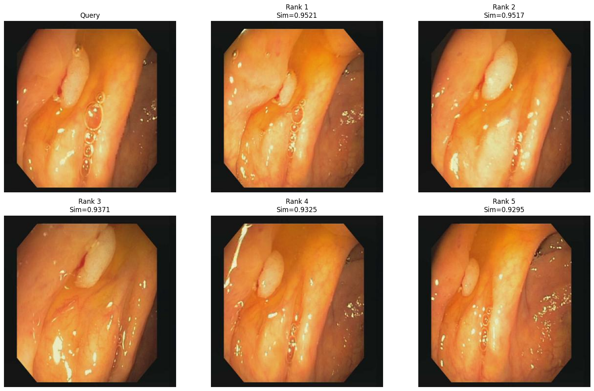
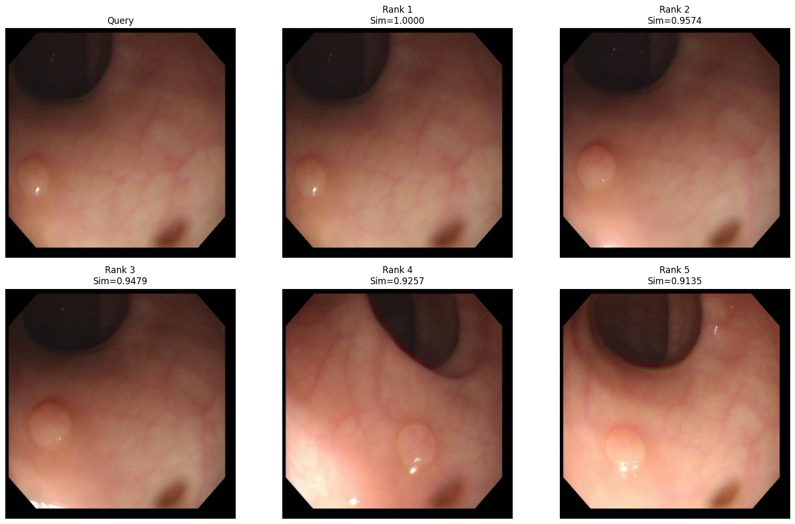
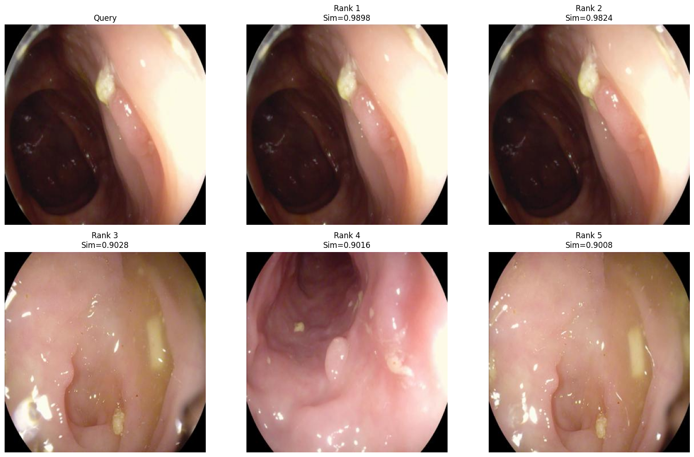
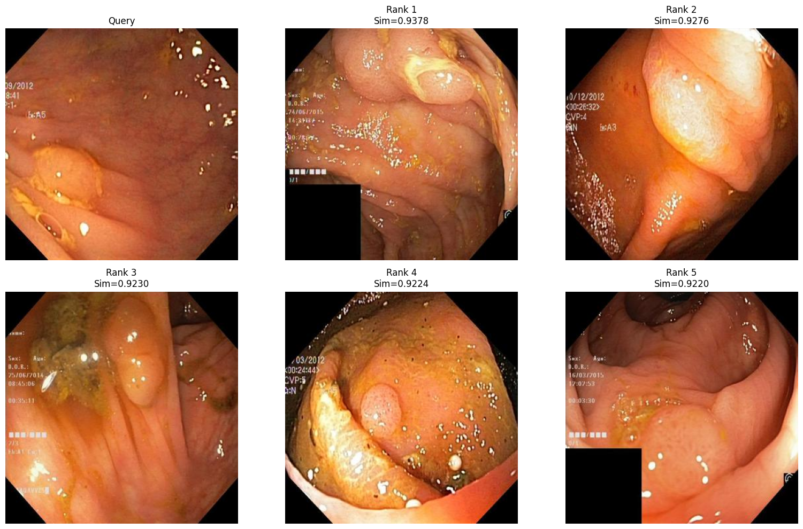

# Dataset-Retrieval-of-Colonoscopy-Polyp-Images-Using-Medical-Foundation-Models

## MedGemma Image Retrieval & Explanation

This repository contains a pipeline for content-based medical image retrieval and automated visual explanation using state-of-the-art vision-language models (VLMs). 

The system takes a query medical image (e.g., an endoscopic view of a polyp), searches a database for the most visually and medically similar images, and then generates an educational explanation comparing the two images.

## Key Features
* **Fast Image Retrieval:** Uses Google's `medsiglip-448` to generate high-dimensional image embeddings and calculates cosine similarity to retrieve the top-K matching images.
* **Automated Medical Explanations:** Uses Google's `medgemma-4b-it` (quantized to 4-bit for memory efficiency) to compare the query and retrieved images. It highlights visible features like polyp presence, shape, border, color, texture, and mucosal patterns.
* **Efficient Inference:** Leverages `bitsandbytes` for 4-bit model loading, allowing large VLMs to run on standard consumer GPUs.
* **MedSAM Integration Ready:** The environment is pre-configured with Meta's Segment Anything (SAM) and MedSAM for potential downstream medical image segmentation tasks.

## Prerequisites & Setup

### Hardware
* An NVIDIA GPU is highly recommended (and practically required) for generating embeddings and running the MedGemma 4B model in a reasonable amount of time.

### Datasets
The script is configured to work with standard gastrointestinal image datasets. Ensure you have the datasets downloaded and extracted to the correct paths:
* Kvasir-SEG
* CVC-ClinicDB
* CVC-ColonDB
* ETIS-LaribPolypDB

### Installation
Install the required dependencies:

`pip install -U transformers accelerate bitsandbytes pillow numpy pandas scikit-image opencv-python tqdm matplotlib`
`pip install git+https://github.com/facebookresearch/segment-anything.git`

Clone and install MedSAM:
`git clone https://github.com/bowang-lab/MedSAM.git`
`cd MedSAM`
`pip install -e .`
`cd ..`

### Hugging Face Authentication
Both MedSigLIP and MedGemma require access via Hugging Face. MedGemma is a gated model, so you must accept the terms on the Hugging Face website before using it.

You will need to pass your HF Token to the script:
`from huggingface_hub import login`
`login("YOUR_HF_TOKEN")`

---

## How It Works

### 1. Build the Retrieval Index
The pipeline first recursively scans your image database (e.g., `Kvasir-SEG/train/images`). It extracts deep feature embeddings for every image using `google/medsiglip-448` and saves them locally as an `.npy` matrix alongside a `.csv` index.

### 2. Retrieve Similar Images
Given a `QUERY_IMAGE`, the system calculates its MedSigLIP embedding and computes the cosine similarity against the entire database index. It returns the top `K` results.

### 3. Generate Medical Explanations
The `MedGemmaSimilarityExplainer` takes over. It loads `google/medgemma-4b-it` and prompts the Vision-Language Model with both the query image and the retrieved image. The model outputs a 3-5 sentence educational explanation of *why* the images are medically similar, focusing on morphological features without making definitive diagnoses.

## Output
* **Visual Plots:** A generated matplotlib grid showing the query image alongside the top ranked retrieved images and their similarity scores.
* **CSV Export:** A final dataframe saved to `retrieval_with_medical_reasons.csv` containing image paths, similarity scores, and the MedGemma generated textual explanations.

**Visual Plots:**

  
  &nbsp;&nbsp;&nbsp;&nbsp;
  

  
  &nbsp;&nbsp;&nbsp;&nbsp;
  

## Disclaimer
This project is for **educational and research purposes only**. The outputs generated by the AI models (MedGemma, MedSigLIP) do not constitute professional medical advice, diagnosis, or treatment. Always consult a qualified healthcare provider for medical decisions.

## Acknowledgements
* [Google MedGemma](https://huggingface.co/google/medgemma-4b-it)
* [Google MedSigLIP](https://huggingface.co/google/medsiglip-448)
* [MedSAM](https://github.com/bowang-lab/MedSAM)
